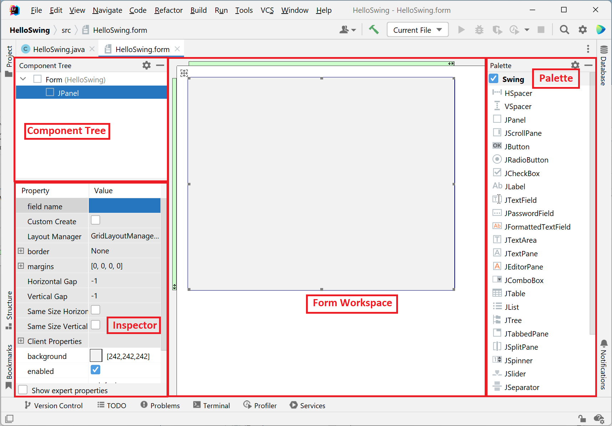

# O pacote Swing

## O qué o Swing?

O pacote Swing é atualmente a principal biblioteca para implementação de interfaces Desktop em Java. 
Assim como a lingua Java em si, os componentes presentes no pacote Swing também são portáveis. 
Em outras palavras, a estrutura da interface desenhada será a mesma independente da plataforma no qual a aplicação está sendo executada.
Os componentes Swing são totalmente implementados em Java, e estão disponíveis por meio do pacote `javax.swing`. 
Isto permite que os mesmos componentes estejam disponíveis---e tenham o mesmo funcionamento---em qualquer plataforma que o programa for executado. 
Além disso, todo componente Swing é mapeado para seu respectivo objeto em Java, permitindo que o desenvolvedor altere suas propriedades dinamicamente durante a execução do programa.

Os componentes existentes no pacote Swing podem ser divididos em 4 grupos principais:

- Containers: Componentes utilizados para agrupar, exibir, e esconder os demais componentes Swing.
- Controles: Componentes diversos, tais como labels, caixas de texto, radio buttons, checkboxes, etc.
- Menus: Componentes voltados para a criação de menus no programa.
- Janelas: Componentes voltados para a criação de janelas independentes no programa, tais como pop-ups e mensagens de notificações.

Este material lida principalmente com os componentes presentes nos grupos Containers e Controles.
Porém o uso de componentes dos demais grupos é totalmente incentivado.

## Hello, Swing!

Para este material, iremos utilizar a IDE IntelliJ para a criação de interfaces gráficas utilizando o Swing.
Essa escolha se deve ao fato da IDE fornecer uma ferramenta gráfica para configuração da interface, o que facilita bastante o trabalho de construção!

### Criação do Projeto

Antes de trabalharmos com o pacote swing propriamente dito, é necessário criar um novo projeto.

- Comece criando um projeto Java no IntelliJ, chamado HelloSwing.
- Lembre-se de desmarcar a opção "Add sample code", para criar um projeto vazio


Com o projeto criado, podemos agora utilizar os recursos da IDE para criação da nossa primeira interface gráfica.
Para isso, você deverá criar uma nova `GUI Form`.

- Clique com botão na pasta `src`.
- Crie uma nova Janela de Interface Gráfica através da opção *New > Swing UI Designer > GUI Form*.

- Dê o nome "HelloSwing" ao formulário e a classe que será criada com ele.


Após esse procedimento, o IntelliJ irá criar dois arquivos: `HelloSwing.java` e `HelloSwing.form`.
Na verdade, o pacote Swing precisa apenas do arquivo `.java` para carregar a interface; como mencionado anteriormente, toda interface GUI implementada via Swing é escrita puramente em Java.
Os arquivos `.form` tem como finalidade permitir que essa interface seja criada visualmente pelo usuário.
Cada mudança realizada neste arquivo---como adição de componentes---é atualizada automaticamente no arquivo `.java` da GUI.

### O arquivo `HelloSwing.form`



Ao abrir o arquivo `HelloSwing.form`, o IntelliJ irá carregar o Editor Visual.
Esse painel pode ser dividido em quatro partes:

- **Component Tree:** Responsável por exibir a árvore de componentes da GUI. Essa árvore define a relação hierárquica presente entre os componentes. Por meio da hierarquia o desenvolvedor pode, por exemplo, trabalhar e configurar o funcionamento de vários componentes simultâneamente.
- **Inspector:** Esse painel apresenta as propriedades de cada componente selecionado e presente na GUI Form. Através destas propriedades é possível customizar propriedades como texto a ser exibido em um botão, ou o estilo de fonte a ser adotado em um texto da interface.
- **Palette:** Este painel disponibiliza os componentes de interface gráfica mais comuns presentes na API Swing para serem utilizados na construção da sua interface. É justamente por meio dessa paleta que os componentes são adicionados visualmente a nossa GUI Form presente no Form Workspace.
- **Form Workspace:** Esse painel ocupa a parte central da tela e apresenta visualmente GUI Form que está sendo implementada, representada pelo retângulo cinza. É justamente através do workspace que o desenvolvedor realiza as alterações e modificações visuais da sua GUI, como inclusão, posicionamento, configuração, e remoção de componentes.

### Protipação da Janela


Nós vamos montar o formulário exibido acima.
Para isso, siga as etapas a seguir:

- Arraste um componente `JLabel` da paleta para a tela, e o centralize utilizando o componente `HSpacer`.
- Altere as propriedades do JLabel para incluir um texto personalizado, aumentar a fonte (24pt), e deixá-la em negrito.

- Adicione agora, abaixo do label "Hello, Swing", dois `JLabel`, um `JTextField`, e um `JButton`.
- Organize os componentes de forma que um label e o campo de texto fiquem lado-a-lado, e o botão fique abaixo dos dois.
- Posicione o outro label abaixo do botão
- Utilize o inspector para definir o nome, texto e outras propriedades dos componentes de forma que fique parecido com a imagem abaixo.


### Execução do programa

Após finalização da prototipação, podemos executar o programa.
A execução de todo programa Java se dá por meio de um método `main`, e a execução de programas GUI implementados com Swing não é diferente.


Ao alternar para o arquivo `HelloSwing.java`, você irá observar que a classe possui apenas a declaração de alguns atributos representando os componentes da tela.
Em outras palavras, não há a presença de um `main` para inicializar a interface.

Existem duas formas de se implementar esse método para iniciar a execução do seu programa: (a) manualmente, onde você implementa cada uma das instruções necessárias para carregar a interface gráfica; (b) automaticamente, onde a IDE gera o código necessário para inicializar a GUI Form criada anteriormente.
Nós iremos adotar o método automático.

Para gerar o `main` que irá carregar a GUI Form você deve abrir o arquivo `HelloSwing.java` e, com botão direito, acessar a opção *Generate > Form main*.
A execução deste comando deverá gerar um método `main` na classe, e preenchê-lo com o código necessário para executar e abrir o GUI Form implementado anteriormente.
Agora, basta executar o projeto e ver sua interface gráfica ser carregada na tela, conforme imagem abaixo.


### Tratamento de Eventos

#### Eventos, o que são?

Nossa interface gráfica está em execução, porém ela não responde aos nossos comandos; por exemplo, nada acontece ao clicar no botão *Mostrar!*.
Toda implementação feita até o momento foi voltada para configuração dos componentes da interface; **ainda falta implementar o comportamento desses componentes**.

Quando se desenvolve um programa com interface gráfica, os comportamentos dos componentes são definidos por meio de eventos.
Os eventos representam ações que serão disparadas após interação do usuário com um dos componentes da tela.
Especificamente, cada componente possui uma série de eventos responsáveis por reagir às mais variadas ações realizadas por um usuário.
Por exemplo, o componente `JButton` possui eventos que, se configurados, serão disparados durante o clique do usuário.
Já o componente `JTextField` possui eventos que serão disparados toda vez que um usuário digitar um caractere no campo de texto.
Os eventos atrelados a estes componentes são conhecidos como *listeners*.

Os *listerners* podem ser definidos por meio de métodos que tenham a seguinte sintaxe: *add\<TIPO_EVENTO\>Listener*.
Retomando o exemplo do parágrafo anterior, o *listener* clique de um `JButton` pode ser definido pelo método `addActionPerformed(ActionListener listener)`; já o *listener* referente ao preenchimento de um `JTextField` pode ser implementado pelo método `addKeyListener(Keylistener listener)`.
Na verdade, os *listeners* são implementados seguindo o padrão de projeto Observador.
Se quiser entender como eles funcionam internamente, recomendo a leitura do material [Padrões de Projeto: Observador](https://engsoftmoderna.info/cap6.html#observador).

#### Implementação do clique do botão

Neste tutorial nós iremos implementar o evento de clique do botão.
A ideia é, ao clicar no botão, a GUI seja atualizada com o conteúdo fornecido pelo usuário no campo de texto (conforme figura acima).

- Abra o arquivo `HelloSwing.java` e crie um construtor para a classe
- Acesse o atributo que represente o `JButton` presente no Form, e faça a chamada do método `addActionListener()`.

```java
private JButton btnShow;
...
public HelloSwing() {
    this.btnShow.addActionListener(...);
}
```

Como se pode observar, o método deve receber um *listener* como parâmetro.
Esse listener representa justamente o objeto que conterá a ação a ser executada quando o evento vier a ser disparado pelo usuário.
Esse objeto deve ser (ou herdar) `ActionListener`; uma interface que especifica justamente os métodos a serem executados quando uma ação for realizada sobre o botão.

- Crie e inicialize, utilizando a técnica de classe anônima, o objeto `btnShowClicked`.

```java
ActionListener btnShowClicked = new ActionListener() {
    @Override
    public void actionPerformed(ActionEvent e) {
        // Comandos que serão executados quando botão for clicado
    }
};
this.btnShow.addActionListener(btnShowClicked);
```

- Implemente os comandos que buscarão o nome digitado no campo de texto, e o escreverão no label fornecido ao final da tela.

```java
@Override
public void actionPerformed(ActionEvent e) {
    // Comandos que serão executados quando botão for clicado
    String name = txtNome.getText();
    lblNome.setText("Olá, " + name + "!");
}
```

Execute o programa, forneça seu nome, e clique no botão.
Seu programa deverá exibir o nome digitado no `JLabel` posicionado ao final da tela, conforme imagem abaixo.


**Isso conclui a primeira parte do tutorial sobre o pacote `javax.swing`.**
