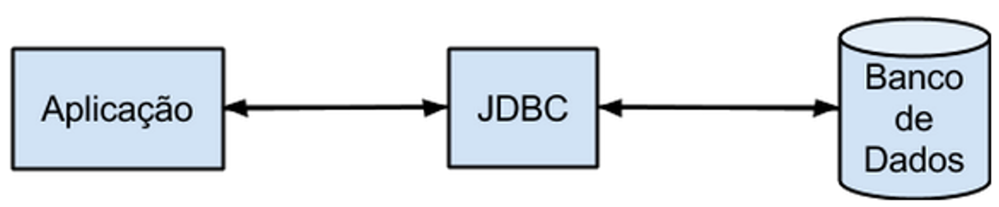

# Java e API JDBC: Tutorial

## Introdução

Em Java, o acesso a banco de dados é feito através da API JDBC (Java Database Connectivity).
Mais especificamente, a API JDBC é um componente reponsável pela ligação entre a nossa aplicação e banco de dados responsável por armazenar as informações do nosso programa.
A figura abaixo ilustra como essa comunicação é feita.



Como principal benefício, a API JDBC fornece acesso às informações do banco de dados independente de plataforma e modelo de banco.
Na prática, isso significa que alterações no sistema ou no banco de dados da aplicação não impactam na forma de como a aplicação se comporta.

Para conexão ao banco de dados, é preciso baixar o driver referente ao banco no qual se deseja trabalhar.
Um driver é uma espécie de biblioteca, que contém o código necessário para se comunicar especificamente com o banco de dados utilizado na aplicação.
Os drivers são geralmente disponibilizados nas páginas de seus respectivos banco de dados ([MySQL](https://dev.mysql.com/downloads/connector/j/)).

### Como Adicionar driver MySQL em um projeto Java?

Há basicamente duas formas de se adicionar o driver do banco de dados em seu projeto.

A primeira, e mais simples delas, é adicionar o `.jar` do driver manualmente em seu projeto.
Para isso deve-se acessar o site do driver desejado e realizar o download da bibilioteca.
Em seguida, é preciso incluir essa biblioteca no projeto.
Esse procedimento costuma variar de acordo com a IDE utilizada.
No IntelliJ, o `.jar` pode ser adicionado como uma [nova dependência](https://stackoverflow.com/questions/1051640/correct-way-to-add-external-jars-lib-jar-to-an-intellij-idea-project) no projeto.

A segunda forma---mais automatizada e menos propensa a erros---pode ser realizada utilizando gerenciadores de dependências (Maven, Gradle, etc).
Os drivers também estão disponíveis nos repositórios dessas dependências.
Portanto, tudo que o desenvolvedor precisa fazer é [declarar a dependência](https://mvnrepository.com/artifact/mysql/mysql-connector-java) desse driver no arquivo de configurações e fazer o *rebuild* do projeto.

Como este projeto está configurado para utilizar o Gradle como gerenciador de dependências, tudo que precisamos fazer é incluir o driver como dependência no arquivo *build.gradle*, conforme exemplo abaixo:

````gradle
dependencies {
    // ...

    implementation 'mysql:mysql-connector-java:8.0.27'
}
````

## Como funciona

Como já dito anteriormente, a API JDBC é responsável por intermediar a comunicação entre a aplicação e seu banco de dados.
Em outras palavras, todo tipo de ação realizada no banco deve ser feita através do JDBC.
Essas ações incluem: (a) Estabelecimento de conexão com banco de dados; (b) Envio de requisições SQL (SELECTs, INSERTs, UPDATEs, DELETEs, etc.); e (c) Processamento do resultado.

### Estabelecimento de conexão

O estabelecimento de uma conexão com o banco de dados geralmente segue o padrão presente no exemplo a seguir.

````java
public class Conexao {
    
    //... 
    
    public static Connection getConnection() {

        //String de conexão
        String uri = "jdbc:mysql://localhost:3306/todolist";

        // usuário e senha de autenticação ao banco
        String usuario = "root";
        String senha = "";

        // variável responsável por realizar a conexão ao banco
        Connection conn = null;

        try {
            //Carregando o driver
            Class.forName("com.mysql.cj.jdbc.Driver");

            //abrindo a conexão
            conn = DriverManager.getConnection(uri, usuario, senha);
        } catch (ClassNotFoundException e) {
            System.out.println("Driver não carregado");
        } catch (SQLException e) {
            System.out.println("Conexão não realizada");
        }
        return conn;
    }
}
````

Como podemos perceber, é preciso fornecer três parâmetros para realizar uma conexão com o banco de dados: `URL`, `usuario` e `senha`.
A variável `URL` contém a `String` de conexão necessária para identificar em qual banco a aplicacão deverá se conectar.
Essa variável deve conter, necessáriamente, o prefixo referente ao tipo do SGBD (*jdbc:mysql*), o endereço do servidor onde o SGBD está em execução (*localhost:3306*), e nome do schema (*todolist*).

Por sua vez, as variáveis `usuario` e `senha` armazenam o usuário e senha necessários para se conectar no banco.
Por fim, a conexão é armazenada na variável `conexao`.
É através desta variável que todas as consultas no banco de dados são realizadas.

### Envio de requisições SQL (SELECTs, INSERTs, UPDATEs, DELETEs, etc.)

Para realizar uma requisião ao banco de dados, é necessário criar um objeto do tipo `Statement`.
Esse objeto é o responsável por executar os comandos que serão executados no banco de dados.
Logo após a criação do objeto, deve-se executar o método `execute*(String sql)`.
Este método recebe como parâmetro uma `String` que contém o comando SQL a ser executado.
Um exemplo de utilização pode ser visto abaixo.

````java
import java.sql.SQLException;

public class UsuarioDAO {
    
    // ...
    
    public static void salvar(Usuario u) {
        Connection conexao = Conexao.getConnection();

        try {
            Statement statement = (Statement) conexao.createStatement();
            statement.execute("Insert into usuario (nome, idade) values ('" + u.nome + "', " + u.idade + ")");
        } catch (SQLException e) {
            System.out.println("Erro ao salvar dados");
        }
    }
}
````

### Processamento do resultado

Todos os métodos que executam uma operação no banco de dados retornam um valor como resultado de sua execução:

* `execute(String sql)`: Retorna um valor indicando se a consulta retorna um ou mais resultados. true indica vários resultados, enquanto false indica um resultado
* `executeQuery(String sql)`: Retorna um objeto do tipo ResultSet, que representa um conjunto de elementos. Geralmente utilizado para execução de comandos do tipo SELECT.
* `executeUpdate(String sql)`: Retorna um valor inteiro indicando quantas linhas foram afetadas pela execução do comando. Geralmente utilizado para execução de comandos do tipo INSERT, DELETE e UPDATE.

### A classe ResultSet

Objetos do tipo ResultSet são tipicamente utilizados para manipular dados provenientes do resultado de uma consulta do tipo SELECT do banco de dados.
Mais especificamente, esse objeto contém uma tabela com as informações recuperadas do SELECT.
Para iterar sobre as linhas da tabela, utiliza-se o método `next()`.
Para a seleção da coluna, e consequentemente recuperar seu valor, utiliza-se o método `get*(String nome_coluna)` ou `get*(int indice_coluna)`, onde `*` representa o tipo do dado a ser recuperado (Como `double`, `String`, `boolean`, etc.).

````java
import java.sql.SQLException;
import java.util.ArrayList;

public class UsuarioDAO {

    // ...

    public static List<Usuario> getALl() {
        Connection conexao = Conexao.getConnection();
        List<Usuario> usuarios = new ArrayList<>();

        try {
            Statement statement = (Statement) conexao.createStatement();
            ResultSet rs = statement.executeQuery("SELECT * FROM usuarios");

            while (rs.next()) {
                String nome = rs.getString("nome");
                int idade = rs.getInt("idade");
                
                usuarios.add(new Usuario(nome, idade));
            }
        } catch (SQLException e) {
            System.out.println("Erro ao salvar dados");
        }
        
        return usuarios;
    }
}
````

## Atividade: Hello, JDBC

Com base nos conceitos descritos neste tutorial.
Implemente um programa para adicionar e buscar usuários a partir de um banco de dados.
Os usuários são representados por uma tabela que possui três atributos: `id` (PRIMARY KEY), `nome`, e `idade`.

Para realizar sua consulta, você deverá implementar uma classe chamada `User`, que representará os usuários a serem lidos/cadastrados no banco de dados.
Naturalmente, essa classe deverá conter atributos para representar os campos da tabela `usuarios`.

Ainda, crie uma classe auxiliar chamada `UserDAO` que irá efetivamente fazer o cadastro e consulta dos usuários.
Especificamente, essa classe deverá implementar os seguintes métodos:

* `void save(User u)`, que deverá salvar o usuário enviado como parâmetro no banco de dados;
* `List<User> getAll()`, que deverá retornar todos os usuários presentes no banco de dados;
* `User getById(int id)`, que deverá retornar um usuário específico com base em seu `id`, ou `null` caso ele não exista;
